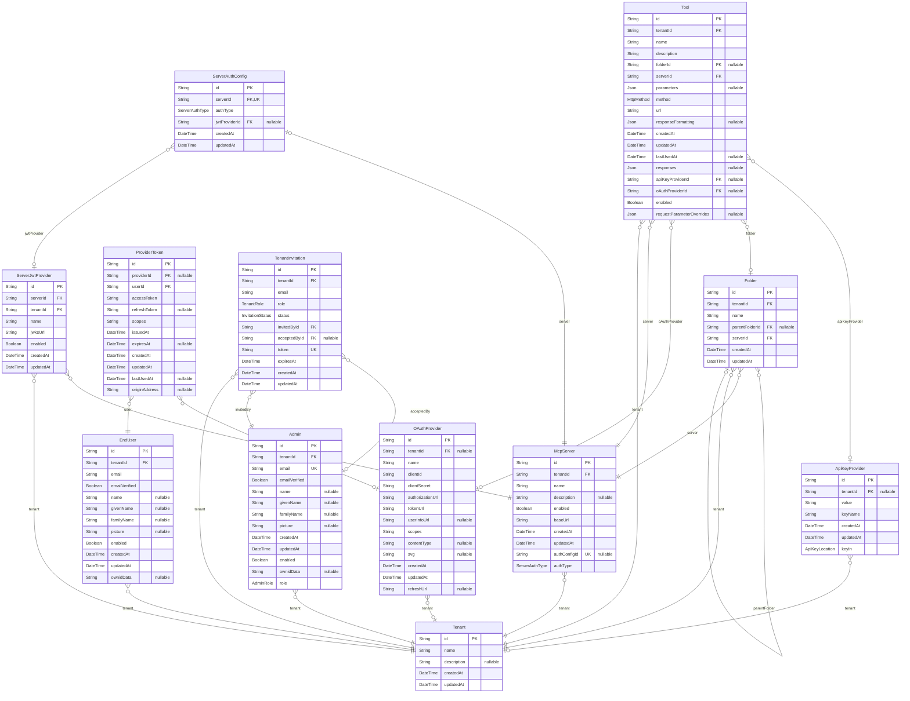

# AgentBridge

> Generated by [`prisma-markdown`](https://github.com/samchon/prisma-markdown)

- [default](#default)

## default

### `Tenant`

**Properties**

- `id`:
- `name`:
- `description`:
- `createdAt`:
- `updatedAt`:

### `EndUser`

**Properties**

- `id`:
- `tenantId`:
- `email`:
- `emailVerified`:
- `name`:
- `givenName`:
- `familyName`:
- `picture`:
- `enabled`:
- `createdAt`:
- `updatedAt`:
- `ownidData`:

### `Admin`

**Properties**

- `id`:
- `tenantId`:
- `email`:
- `emailVerified`:
- `name`:
- `givenName`:
- `familyName`:
- `picture`:
- `createdAt`:
- `updatedAt`:
- `enabled`:
- `ownidData`:
- `role`:

### `McpServer`

**Properties**

- `id`:
- `tenantId`:
- `name`:
- `description`:
- `enabled`:
- `baseUrl`:
- `createdAt`:
- `updatedAt`:
- `authConfigId`:
- `authType`:

### `Folder`

**Properties**

- `id`:
- `tenantId`:
- `name`:
- `parentFolderId`:
- `serverId`:
- `createdAt`:
- `updatedAt`:

### `Tool`

**Properties**

- `id`:
- `tenantId`:
- `name`:
- `description`:
- `folderId`:
- `serverId`:
- `parameters`: Record<string, OpenAPIV3.ParameterObject>
- `method`:
- `url`:
- `responseFormatting`: FormattingConfig
- `createdAt`:
- `updatedAt`:
- `lastUsedAt`:
- `responses`: Record<string, OpenAPIV3.ResponseObject>
- `apiKeyProviderId`:
- `oAuthProviderId`:
- `enabled`:
- `requestParameterOverrides`: Record<string, string>

### `OAuthProvider`

**Properties**

- `id`:
- `tenantId`:
- `name`:
- `clientId`:
- `clientSecret`:
- `authorizationUrl`:
- `tokenUrl`:
- `userInfoUrl`:
- `scopes`:
- `contentType`:
- `svg`:
- `createdAt`:
- `updatedAt`:
- `refreshUrl`:

### `ApiKeyProvider`

**Properties**

- `id`:
- `tenantId`:
- `value`:
- `keyName`:
- `createdAt`:
- `updatedAt`:
- `keyIn`:

### `ProviderToken`

**Properties**

- `id`:
- `providerId`:
- `userId`:
- `accessToken`:
- `refreshToken`:
- `scopes`:
- `issuedAt`:
- `expiresAt`:
- `createdAt`:
- `updatedAt`:
- `lastUsedAt`:
- `originAddress`:

### `TenantInvitation`

**Properties**

- `id`:
- `tenantId`:
- `email`:
- `role`:
- `status`:
- `invitedById`:
- `acceptedById`:
- `token`:
- `expiresAt`:
- `createdAt`:
- `updatedAt`:

### `ServerAuthConfig`

**Properties**

- `id`:
- `serverId`:
- `authType`:
- `jwtProviderId`:
- `createdAt`:
- `updatedAt`:

### `ServerJwtProvider`

**Properties**

- `id`:
- `serverId`:
- `tenantId`:
- `name`:
- `jwksUrl`:
- `enabled`:
- `createdAt`:
- `updatedAt`:
